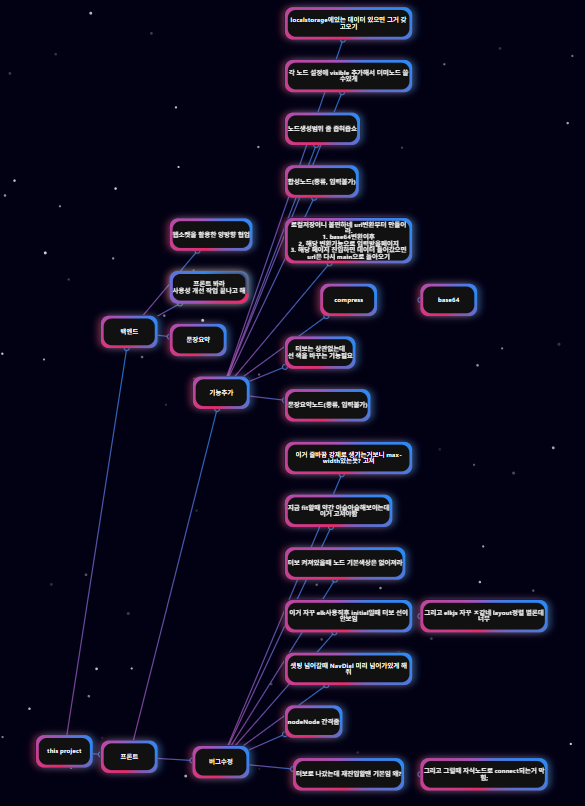
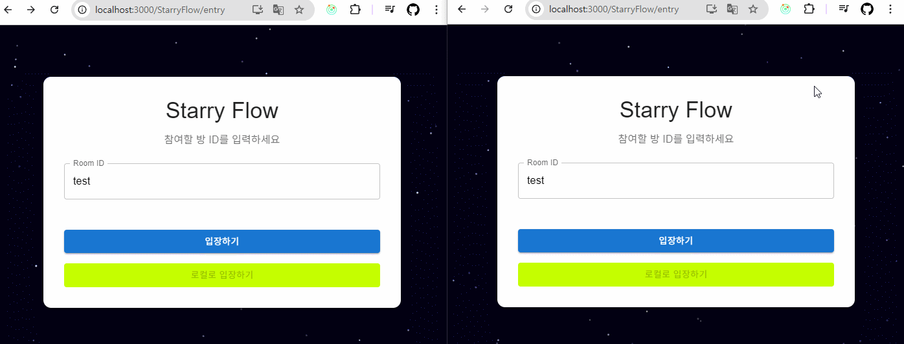

# :sparkles: [StarryFlow](https://potato3641.github.io/StarryFlow/#/) (2025.04.30 ~ 2025.05.22)

> "별처럼 흩어진 생각을 하나로 잇다"  
아이디어를 마인드맵 방식으로 정리하고, 실시간 협업까지 가능한 웹 메모장

[프로젝트 바로 사용하러가기(배포중)](https://potato3641.github.io/StarryFlow/#/)

### :hammer_and_wrench: **기술 스택**
  - React
  - React Flow
  - Redux
  - WebSocket
  - ELK.js
  - MUI
  - Fast API
  - gunicorn
  - nginx
  - Oracle Cloud
  - AWS EC2

### :bulb: **주요 기능**
  - 마인드맵 스타일의 메모 연결 및 자동 배치
  
  - WebSocket 기반 실시간 협업 및 동기화
  
  - URL 공유로 손쉬운 접근

### :dart: **핵심 과제**
  - React Flow의 커스터마이징 (노드/엣지/레이아웃 방향)
  - 메시지 구조 설계 및 소켓 이벤트 핸들링
  - 임시 저장과 복원 로직 구조화 (로컬한정)

### :page_with_curl: **회고**
  - 작성중...

## :blue_book: 프로젝트 과정

### :bulb: motivation
  - 아이디어 정리를 보통 메모장에 하고있음
  - 근데 이게 많아지니까 폴더 분류를 하고있었는데 찾기가 귀찮아짐
  - 검색도 한두번이지 심지어 내용검색까지 하고있으려니 너무 빡빡함
  - 내용 요약도 해볼까? 하는 생각도

### :dart: goal
  1. 마인드맵 형식의 웹 메모장
  2. 메모를 로컬 스토리지에 저장
  3. 추후 가능하다면 클라우드에 저장 -> URL로 변경
  4. 추후 가능하다면 메모를 ai모델을 사용해서 요약 및 검색 기능까지... -> 소켓 통신을 이용한 양방향 협업 기능

### :hammer_and_wrench: 기획 및 구현 가능성 테스트 (25.02.24 ~ 25.02.26)
  - 컨셉 정리: 우주/별/생각의 흐름
  - 기본 기능 구상: 메모 연결, UI 구성, 저장방식

### :brain: 아이디어 정리 (25.04.22 ~ 25.04.28)
  - React Flow 기본 구조 세팅 학습
  - darge.js 적용하여 레이아웃 자동 배치 테스트
  - 3개 이상의 컴포넌트에서 사용되는 props을 대체하기 위한 redux 공부 및 적용 테스트
  - 프로젝트명 brainSprinter -> StarryFlow로 변경

### :hammer_and_wrench: 본개발 (25.04.30 ~ 25.05.03)
  - 기본 구조와 추가 옵션 구성 구현
  - 확장성은 생각하지 않고 떠오르는 아이디어대로 구현
  - 개발하며 최대한 사용하기 불편한 부분은 쳐냄

### :test_tube: 1차 사용자 경험 피드백 (25.05.04 ~ 25.05.13)
  - [버그 및 기능 추가/수정](#1차-사용성테스트)
  - 백엔드 구성 시작
  - 소켓 통신 구조 설계 및 적용
  - 실시간 동기화 및 협업 기능 구현

### :test_tube: 2차 사용자 경험 피드백 (25.05.14 ~ 25.05.17)
  - [버그 및 기능 추가/수정](#2차-사용성테스트)
  - UX/UI 중심 개선점 적용
  - host/guest/new guest 간의 데이터 동기화 및 히스토리 축약
  - 배포 및 기본 테스트 완료
  
### :package: 마무리 및 회고 (25.05.22)
  - gitgub pages 리다이렉트 문제 수정
  - 프로젝트 정리 및 문서화
  - 사용기술 정리
  - **백엔드의 프로덕션과 라이브 코드는 다를 수 있습니다.**

<details open>
  <summary>completed develop note</summary>

## develop task - complete
  ### map에 관한 아이디어
   - 디자인은 밤하늘 컨셉으로
   - 개체당 작업
     - 더블 클릭 시 내용 수정 (제목 / 내용) -> NodePanel에서 변경
     - 우클릭으로 삭제 -> backspace로 삭제
     - 분화는 어떻게하지? -> 자유
     - 분화는 8개제한 시계 8방향, 리프노드일 경우만 색으로 구분지어주기 -> 자유
   - page 작업
     - 저장(cloud용 버튼만 일단) -> localstorage로 일단 완료
     - 정리(집나간 개체들 가운데 모아주기) -> 완료
     - 공유(hex변환 page)
     - share는 base64거쳐서, 서버로는 compress만
   - drag div 만들어서 직접 연결하기 -> react flow에 스타일 붙이기로 변경
  - 작업중... darge sort : edge handle problem -> elkjs로 변경됨
  - edge변경작업을 하며 느꼈는데 진지하게 공부해서 redux를 추가해야겠다 -> 완료
  - redux하다가 꼬이고 내가 원하는 커스텀 상태에서 handle 수직/수평이 결국 안되는거에 화나서 그냥 connectedLine으로 변경 결정 -> 완료
  ### selectedNode작업(redux 값 변화)
   - 노드클릭(FlowCanvas/onNodeClick)
     - setSelectedNode (empty -> id)
     - setsLabel (empty -> label)
     - setsFontSize (empty -> fontSize)
   - 판넬오픈(NodePanel)
     - empty -> state.flow.sLabel
     - empty -> state.flow.sFontSize
     - empty -> state.flow.defaultNodeColor
     - empty -> state.flow.defaultEdgeColor
     - empty -> state.flow.defaultValue
   - 판넬작성후apply(NodePanel/applySelectedNode)
     - setsLabel (label -> newLabel)
     - setsFontSize (fontSize -> newFontSize)
     - activateApplyFlag (false -> true)
     - setDefaultNodeColor (nodecolor -> newNodeColor)
     - setDefaultEdgeColor (edgecolor -> newEdgeColor)
     - setDefaultNodeValue (value -> newValue)
   - 캔버스업데이트(FlowCanvas/useEffect)
     - deactivateApplyFlag (true -> false)
     - clearSelectedNode (id -> empty)
     - clearsLabel (newLabel -> empty)
     - clearsFontSize (newFontSize -> empty)
   - 추후 추가될 노드 수정작업은 위에 추가해서 정리하는걸로
  - Node-Line-Edge 구성 및 노드 수정 및 연동 기능 완료
  - modification function에 width height도 넣어보고싶은데 -> 취소 : relative로 변경
  - resizer 좀만 더 확인해보기... -> relative로 변경하며 확인할 필요가 없어짐
  - 새 노드 생성기/복제를 잊어버리면 어떡함????????? -> DnD와 adder방식중에 후자 채택(DnD하면 사이드바가 생겨야하는데 사이드바는 프로젝트 ui 컨셉과 안맞음)
  - 새 노드 생성기+ 작업할 때 서브플로우 꼭 확인할것 -> 확인 결과 그룹화는 ui 컨셉에 안맞음
  - 미니맵 괜찮아보이는데 생각해볼것 -> 추가완료
  - save and restore -> 완료
  - utils에 layout.js 다시 활성화하기 이번엔 dargejs 하다가 잘 안되면 elkjs도 고려하기 -> elkjs로 완료
  - FitView layout할때 추가하기 -> 완료
  - 컨셉컨셉 하다보니 이거 프로젝트 제목 컨셉에 안맞는거같은데 프로젝트명을 바꿔야겠는데 편의성을 위해 일단 놔두고 정식명칭을 정해봐야겠음 -> starry flow
  - develop note 점점 task목록같아지는데 이거 분할해서 할까?
  - onadd speeddial 클릭문제 해결(icon range)
  ### settings에 들어갈 옵션 완성하기
   - minimap on/off flag -> 기능완료 mapFlag
   - node 왼쪽정렬/가운데정렬/오른쪽정렬 (선택박스) -> 기능완료 defaultNodeAlign
   - node color 팔레트 -> 기능완료 defaultNodeColor
   - 정렬 후 자동 Fitview on/off flag -> 기능완료 autoFitViewFlag
   - sort 방향 flag -> 기능완료 sortDirectionFlag
   - cycle 형성 방제 on/off flag -> 기능완료 cycleValidateFlag
   - node default value 변경 -> 기능완료 defaultNodeValue
   - blur node value at min-zoom flag -> 기능완료 zoomOutBlurFlag
  - 개편이 필요한것 : connectLine이 너무 얇다 클릭하기 힘들어 -> width 2로 늘렸으나 3을 고려해봐야할듯
  - Setting을 모달로 하기보다 기왕 FlowCanvas 만든거 이거 이용해서 fixed nodes갖고 값 바꾸라고 하면 좋을거같다
    - Settings Elk -> 완료
    - Settings Fit -> 완료
  - color 팔레트 react-color로 진행하다 수많은 레거시 버그에 좌초중 react-colorful로 변경 고려 -> 변경 완료
  - 이제 connect함수 고쳐서 값이 즉각적용되도록 하기 -> 완료
  - apply 눌렀을 때 즉각적용하도록 하기 -> 완료
  - 개편이 필요한것 : nodePanel 엔터키 입력으로도 apply될수있께하기 -> 완료
  - 아맞다 contextual-zoom on/off도 넣어야함 settings -> 완료
  - turboflow 선택지 만들기 -> 완료
  - gh pages deploy하기 -> 완료
  - ai모델에 대한 탐색 : BART-base (500MB, 문서보다 단문 요약에 능함) -> 좋은건 너무 크거나 라이센스 문제가 있고 그게 해결된것들은 오류만 뱉거나 한국어를 잘 못함
  ### 1차 사용성테스트
   - 고쳐야할 버그
     - settings 가기전에 navdial 바뀌기
     - turbo 상태일때 노드 색상 변경 기능 숨기기
     - 줄바꿈 강제로 생기게 하는 max-width 확인하기 -> 300px에서 500px로
     - elk 사용 직후 turbo 선이 안보임
     - elk layered 정렬 종류 살펴보고 바꾸거나/포기하기 -> mrtree로 변경
     - turbo로 나갔지만 재진입시 기본css임
       - 이 때 자식 connect 안되는 버그 발생
     - 재진입시 localstorage에서 안불러옴
     - turbo의 fit이 아슬아슬함. turbo일때는 더 조여야할듯
     - turbo의 nodeNode간격 넓혀야
     - 노드 생성범위를 좁혀야...
   - 필요한 기능
     - 노드의 선 색을 바꾸는 기능도 추가했으면
     - 노드 설정에 visible 추가하기 (개인설정?) -> mrtree 변환 이후실효성이 없음
     - compress - base64
     - 역변환기능도
     - map 초기화기능
 - 소켓관련 자료 수집
  ### 사전 규약 설정
  
   - 필요한 기능?
     - 노드 Position (x, y) - "node_move"
     ```JSON
       {
         type: "node_move",
         payload: {
           id,
           position: {
             x,
             y
           }
         }
       }
     ```
     - 노드 변경 (label) - "node_update"
     ```JSON
       {
         type: "node_update"
         payload: {
           id,
           label,
           fontSize
         }
       }
     ```
     - 노드 생성 - "node_add"
     ```JSON
       {
         type: "node_add"
         payload: {
           id,
           position: {
             x,
             y
           }
         }
       }
     ```
     - 노드 삭제 - "node_delete"
     ```JSON
       {
         type: "node_delete"
         payload: {
           id
         }
       }
     ```
     - 엣지 삭제 - "edge_delete"
     ```JSON
       {
         type: "edge_delete"
         payload: {
           id
         }
       }
     ```
     - ELK 실행 - "elk_layout"
     ```JSON
       {
         type: "elk_layout"
       }
     ```
     - 엣지 생성 - "edge_add"
     ```JSON
       {
         type: "edge_add"
         payload: {
           id,
           source,
           target,
         }
       }
     ```
     - 데이터 일괄불러오기 - "batch_update"
     ```JSON
       {
         type: "batch_update",
         payload: {
           {JSON}, ...
         }
       }
     ```
     - 맵 초기화 - "flow_clear"
     ```JSON
       {
         type: "flow_clear"
       }
     ```
     - 호스트 초기화 - "batch_update_host"
     ``` JSON
       {
         type: "batch_update_host",
         payload: {
           nodes: {
             {
               id,
               position: {
                 x,
                 y,
               },
             },
             ...
           },
           edges: {
             {
               id,
               source,
               target,
             },
             ...
           }, 
         }
       }
     ```
  - 보안관련 자료수집
  ### 제작중인 기능
   - 노드 Position (x, y) - "node_move" -> 완료
   - 노드 변경 (label) - "node_update" -> 완료
   - 노드 생성 - "node_add" -> 완료
   - 노드 삭제 - "node_delete" -> 완료
   - 엣지 삭제 - "edge_delete" -> 완료
   - ELK 실행 - "elk_layout" -> 완료
   - 엣지 생성 - "edge_add" -> 완료
   - 노드 삭제 / 엣지 삭제 시 연결부분 로그 서버에서 삭제처리하기(로그최적화)
  - canvas 사설방과 로컬방 분리하기 -> 완료
  - 서버 - 클라이언트B로 데이터 동기화하는 부분 -> 완료
  - 현재 클라이언트 - 서버 소켓 연결 완료
  - 클라이언트에서 동기화된 데이터를 처리하는 부분이 없다 -> 완료
  - 일단 로그에서 move는 최종상태만 저장할것 -> 완료
  - go set부분이 문제다. settings할 때 task를 멈추게해야하나?
    - stop을 넣어서 2초뒤에 settings에 진입할 수 있도록 해야하나?
    - settings에 대한 변경은 어떻게 적용할까?
    - zoomout이 고집인가?
    - 그럼 어떻게바꿀것인가?
    - broadcast 메세지를 modeflag로 분기해서 tempRef에 처리
  - go set 변경점 이후 테스트하기
  - go canvas 변겅점 이후 테스트하기

  ### 플래그의 동기화가 되지 않는 문제 발생
   - 값이 정해지기전에 mount될때 최초값이 들어가서 문제
   - 그런데 최초값이 변경이 안됨
   - 핸들을 무명함수에서 분리하여 handleMessage로
   - 함수를 useCallback으로 변경
   - onNodesDelete는 한참뒤에 정의하는데 해당 함수에서도 connect를 사용해서 상호참조되어 warning 발생
   - 상호참조대신 직접참조하니까 react hook rule을 위반했다
   - 그렇다고 onNodesDelete를 위로 올리면 안된다
   - function을 쓰면 된다는데 useCallback함수는 function으로 정의할 수 없다
   - useRef와 useEffect로 변경된 onNodesDelete를 갖고있기
   - setModeFlag에도 문제 발생
   - 분명 useCallback으로 setModeFlag 변경되면 바꾸도록 설정했는데 안바뀐다
   - setModeFlag를 useCallback 내부에서 정의할 수 없음
   - onNodesDelete와 마찬가지로 useRef, useEffect로 변경된 setModeFlag를 갖고있기
   - 이외 비슷한 문제 동일처리
   - 이를 해결하고보니 zoomOut이 비동기 이후 처리하는 함수라 zoomOut시간이 고스란히 동기화되지않는시간임
  - zoomOut버려? -> 버림
  - 동기화를 서버만 해놓고 react에서 안받았다!
    - 로그 한번에 받을때 resizerobserver 루프초과 이슈 있음
    - 해결방안 : 사전 규약에 batch_update 신설 -> 완료
      - 서버 설정 완료
      - onNodesDelete는 그만 놔주고 직접 만들어야겠다 -> 안놔주고 onNodesDelete를 재사용성 있게 수정함
  - develop task가 너무 길어져서 summary로 단축
  ### 2차 사용성테스트
   - connect가 끊겼을 때 알림이 콘솔에서밖에 없음
   - socket시에 save/restore는 socket이 끊기면 없어져야함(일회용)
   - elk_layout이 await이므로 async()했을때 바로 적용이 되지 않는 문제
   - node delete시 null.find하는 문제(정확히는 delete했을 때 broadcast시, null이 되는 문제)
   - guest 변화가 서버 host기록에 저장되지않음. (host작성 -> guest작성 -> 새로고침 -> guest는 작성이전상태)
   - host여부를 보여줬으면 좋겠는데 -> dial 색상으로 완료
   - 색상으로 완료하는게 맞음? host 표기좀 -> 호스트용 아이콘 생성
   - 왜 올때마다 connection lost임 local에서도 -> 첫입장 플래그로 false초기화시 문제 해결
   - clearFlow까먹었네
     - clearFlow를 allow_type에 안넣어놓고 왜 서버가 꺼지지 이러고있었네
     - 하는김에 호스트 연결종료되면 오버레이로 덮어씌움
     - 이거덕분에 타입 다른 메세지로 인한 ValueError시에 발생하는 서버 오류 해결함
   - fitView는 어쩔까 -> 데이터에 영향이 없으니 제외
   - help가 없다 튜토리얼 제작하기(무조건만들것) -> 완성
   - connection lost가 로컬 상태일때 사라지지 않는 버그 수정
   - host의 색상을 조금 더 밝게 수정함
   - 가이드에 줌아웃, 끌어내리기 설명 추가하기 -> 테스트해보니 노드클릭하다보면 자연스럽게 알게되는 동작
   - turbo에 컬러 적용이 안되는 버그 재발생 -> connectLine 안고친거 포함해서 완료
   - 가이드 화살표말고 그냥 클릭하면 넘어가기 -> 완료
   - turbo의 테두리를 조금 둥글게 수정함
   - local에 host가있네? -> 수정완료
   - 새 노드 생성위치 화면 중앙으로 변경
   - connectEnd 부활시키기... -> 프로젝트를 이정도 진행했더니 이제 바로 만들 수 있게됨
   - host가 데이터갖고오면 데이터 open할 수 있는 상태로 만들기... -> 완료
     - 데이터 크기 확인 -> ip 확인 -> 타입 확인 -> 기록저장하고 클라이언트로 허용여부 던지기
     - 현재 모두허용인데 roomId있을때 host일경우 서버로 던지기(근데 클라이언트로 해야할듯)
     - host 업데이트용 데이터 사전 규악 batch_update_host 추가
   - 다 하고 2차 사용성테스트 기록용 사진 하나 찍어놓기
   - flow를 정리할 수 있게 하면 어떨까? UI적 정리 말고 데이터 정리로
     - 연결된 노드가 많을수록 밝아지는 UI도 좋아보인다
     - 연결된 노드의 정의는 leaf의 합계로?
     - 이거는 edge만 조사하면된다. regex로 걸러내서 빈도가 많은 노드 검출 가능
     - 통계는 서버에서 하십시오 내용이 많을거같음
      - 어떤 통계를 할지는 다음 테스트에 하자. 아이디어없이 시간끄는느낌?
  - 발동 조건을 찾지 못했는데 게스트 data포함 입장시 duplicate문제있음 해결완료
  - compress 서버 전송 테스트하기
  - aws ec2 서버 구축하기
  - oracle cloud 정상화되면 다시 구동할생각도
  - oracle로 서버 구축완료
  - 발동 조건은 찾지 못했는데 게스트 입장시 getIncomer에서 id에러 있음
  - 소켓 연결 완료
  - DNS 구매 완료
  - DNS 연결 완료
  - redis 사용예정 DNS 구매로 해결
  - 라이브 상황에서 hostFlag가 간혹 제대로 작동하지 않음
    - 브라우저가 최초로 접속하면 hostFlag가 동작하지 않음을 확인함
    - HashRouter로 변경
    - Router 문제 수정중 - urlCopy 고장남
    - 원인파악 : host인 유저에게 you_are_host라는 메세지를 날려주는데, 짧은 시간 내에 접속한 두 사용자에게 모두 you_are_host를 날리고, 이 중에서 늦게 접속한 사람이 host가 되고 처음 접속한 사람은 host로 표시되지만 host가 아님
    - 해결방안1 : async lock을 이용해 중복 you_are_host 방지
    - 해결방안2 : host_notified를 추가하여 flag 설정을 통해 async lock이 끝나고 websocket객체와 비교시켜 you_are_host메세지를 보내게 함.
    - 원인재파악 : 같은 ip의 다른탭에서 동시 사용하면 발생
    - 해결방안1 : id(websocket)으로 탭도 구분하게 함
    - 해결방안2 : global lock으로 async lock의 이중 락 설정 방지
    - urlCopy는 live Router문제로 다시 해결해야함
</details>

<details>
  <summary>progress develop note</summary>
  
## develop task - progress
  - urlCopy 문제
    - 복사된 URL을 넣으면 데이터가 입력이 안됨 -> 해결
    - 복사된 URL을 넣으면 데이터 입력과 host설정은 되는데 duplicate오류가 발생함
    - 데이터 복사 URL을 비활성화하고 문제 해결할것
</details>

<details>
  <summary>waiting develop note</summary>

## develop task - wait
</details>